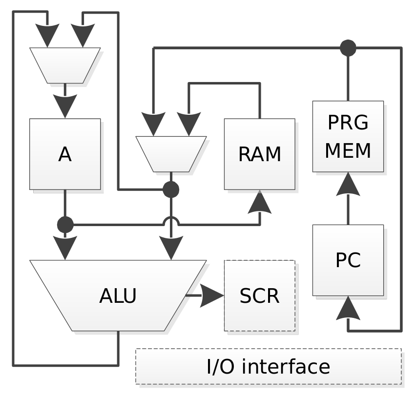

# pCycle

    

> Accumulator-based 4-bit processor.

pCycle processor was created in 2015 after building a redstone processor in Minecraft. The main purpose of pCycle was to apply knowledge gained from that game into real life. As it was my first custom VHDL processor, pCycle was designed in a very simple manner – it is 4-bit and uses an accumulator during instructions execution. And that's almost it. Some of pCycle highlights:

* Harvard architecture
* All instructions are 8 bits wide
* All data are 4 bits wide
* I/O ports in data memory space

## Useful Resources

* [support.md](support.md) – questions, answers, help
* [contributing.md](contributing.md) – how to get involve
* [license](license) – author and license
